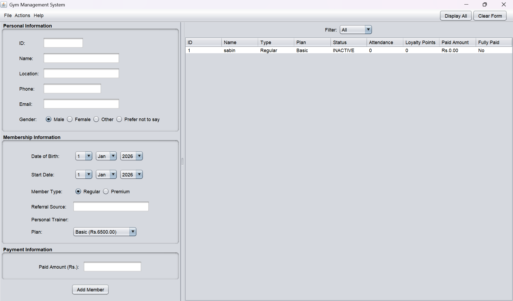

# Gym Management System

A complete **Java Swing** desktop application for managing gym members, tracking attendance, processing payments, and handling member upgrades.

<p align="left">
  
  
  
  
</p>

---

## Table of Contents

- [Features](#features)
- [Tech Stack](#tech-stack)
- [Project Structure](#project-structure)
- [Screenshots](#screenshots)
- [How to Run](#how-to-run)
- [How to Use](#how-to-use)
- [Author](#author)

---

## Features

**Member Management**
- Add Regular and Premium members
- Edit member contact details
- Soft delete with reason (restore later)

**Attendance & Loyalty**
- Mark daily attendance
- Regular members: +5 loyalty points per visit
- Premium members: +10 loyalty points per visit

**Plan Upgrades (Regular Members)**
- Basic → Standard → Deluxe
- Requirements: 30 visits + fully paid on current plan

**Payments & Discounts**
- Record payments (partial or full)
- Premium members get a 10% discount on full payment
- Track due amounts and payment history

**Data Persistence**
- Save all member data to a CSV file
- Load data back into the application
- Human-readable file format

**Filter Views**
- Active — currently active members
- Removed — soft-deleted members
- All — complete member list

---

## Tech Stack

| Category         | Technology    |
|-------------------|---------------|
| Language          | Java 25       |
| GUI Framework     | Swing         |
| Build Tool        | IntelliJ IDEA |
| Data Format       | CSV           |
| Version Control   | Git + GitHub  |

---

## Project Structure

```
GymManagerJava/
├── src/
│   ├── model/
│   │   ├── Plan.java                # Enum: BASIC, STANDARD, DELUXE
│   │   ├── GymMember.java           # Abstract base class
│   │   ├── RegularMember.java       # Regular member with plans
│   │   └── PremiumMember.java       # Premium member with trainer
│   ├── service/
│   │   ├── MemberService.java       # Core business logic
│   │   ├── MemberFileService.java   # CSV save/load
│   │   ├── PaymentResult.java       # Payment result record
│   │   ├── PaymentStatus.java       # Payment status enum
│   │   └── UpgradeResult.java       # Upgrade result record
│   ├── view/
│   │   ├── MainFrame.java           # Main application window
│   │   ├── MemberFormPanel.java     # Add/Edit form
│   │   ├── MemberTablePanel.java    # Member table with filter
│   │   └── MemberFormData.java      # Form data transfer object
│   ├── controller/
│   │   ├── GymController.java       # Controller interface
│   │   └── GymControllerImpl.java   # Controller implementation
│   ├── util/
│   │   └── CurrencyFormatter.java   # Currency formatting utility
│   └── GymApplication.java          # Entry point
├── .gitignore
└── README.md
```

---

## Screenshots



---

## How to Run

### Prerequisites
- Java 21 or higher
- IntelliJ IDEA (or any Java IDE)

### Steps

1. **Clone the repository**
   ```bash
   git clone https://github.com/SabinPant/GymManagerJava.git
   cd GymManagerJava
   ```

2. **Open in IntelliJ IDEA**
   - File → Open → Select the project folder

3. **Run the application**
   - Navigate to `src/GymApplication.java`
   - Right-click → Run `'GymApplication.main()'`

---

## How to Use

### Adding a Member
1. Select the **Regular** or **Premium** radio button in the form
2. Fill in the form fields
3. Click **Add Member** on the form
4. New members start as inactive — use **Activate** to enable

### Tracking Attendance
1. Go to **Actions → Mark Attendance**
2. Enter the Member ID
3. Attendance and loyalty points are updated

### Upgrading a Plan (Regular Members)
1. Regular member must have 30 visits and be fully paid
2. Go to **Actions → Upgrade Plan**
3. Enter Member ID and select a new plan
4. Plan upgrades: Basic → Standard → Deluxe

### Processing Payments
1. Go to **Actions → Pay Due**
2. Enter Member ID and payment amount
3. Premium members get a 10% discount on full payment

### Saving and Loading Data
- **File → Save** — Saves all members to `members_data.csv`
- **File → Load** — Loads members from `members_data.csv`

### Viewing Members
Use the filter dropdown above the table:
- **Active** — shows active members
- **Removed** — shows soft-deleted members
- **All** — shows all members

### Editing a Member
1. Go to **Actions → Edit Selected**
2. Enter Member ID
3. Update contact details (Name, Phone, Email, etc.)
4. Click **Save Changes**

### Deleting and Restoring
- **Actions → Soft Delete** → Enter ID and reason
- **Actions → Restore** → Enter ID to restore

---

## Author

**Sabin**
GitHub: [@SabinPant](https://github.com/SabinPant)

---

If you find this project useful, please consider starring the repository.